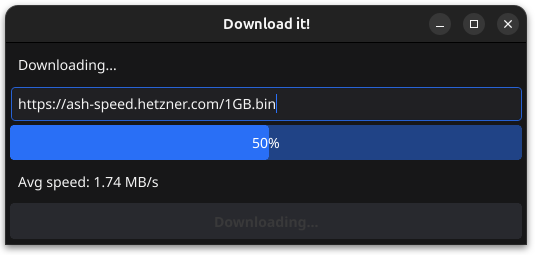

DownloadIt!
---

Example app created using [Fyne](https://fyne.io/).

Pre-reqs
- Fyne lib
- Golang

### Usage
```
$ go run cmd/godownloadit/main.go
```

### Release
```
$ fyne package --src cmd/godownloadit -os linux
```

Now you can extract content from `downloadit.tar.xz` and run `make install`

